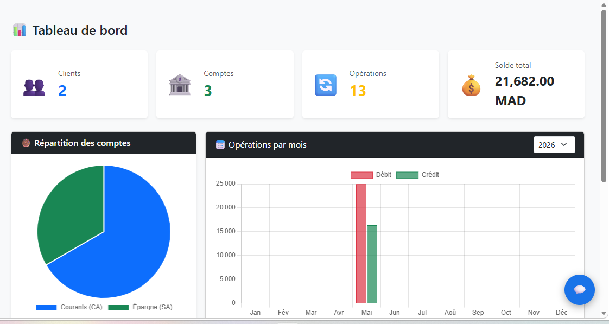
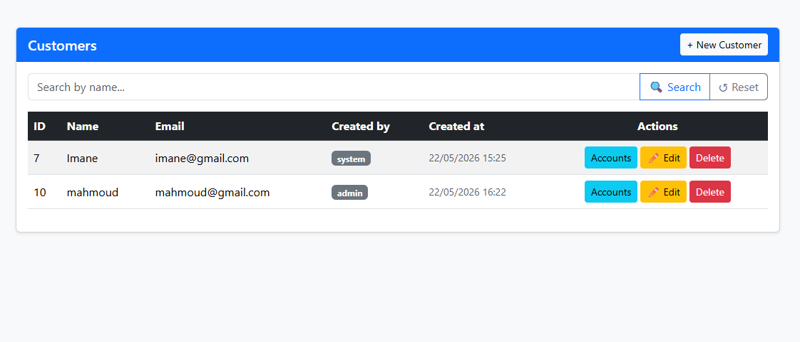
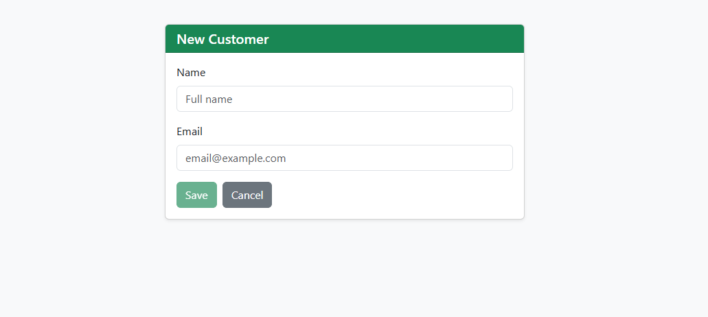
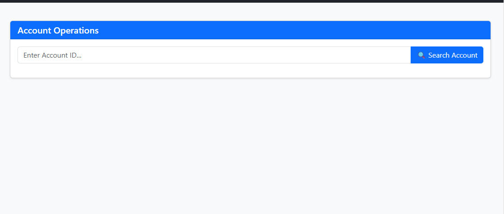
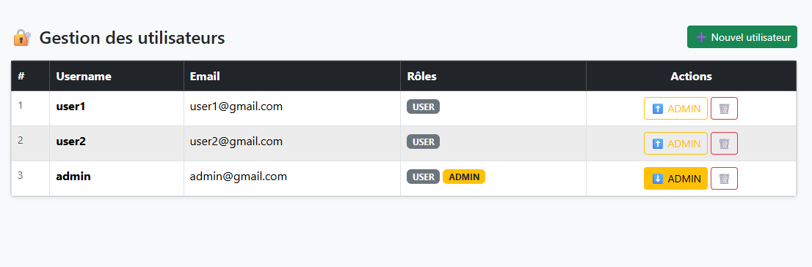
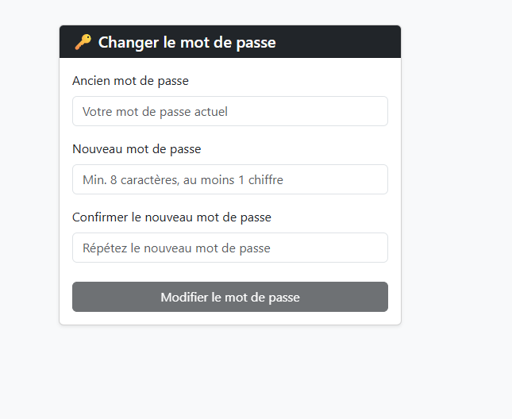
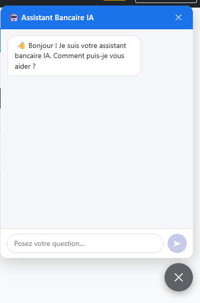

# Rapport de Projet — Architecture JEE

---

<div align="center">

## Université : EMSI
### Filière : Génie Informatique — 4DSIM Groupe 1

---

| | |
|---|---|
| **Étudiant** | Mohamed Mahmoud Sid Mhamed |
| **Professeur** | Mohamed Youssfi |
| **Matière** | Architecture JEE et Frameworks |
| **Année universitaire** | 2025 – 2026 |

---

# Banque AI
## Application de Gestion Bancaire avec Agent Intelligent (RAG)

*Application full-stack développée avec Spring Boot 3 (backend) et Angular 19 (frontend)*

</div>

---

## Table des matières

1. [Introduction](#1-introduction)
2. [Architecture du projet](#2-architecture-du-projet)
3. [Technologies utilisées](#3-technologies-utilisées)
4. [Fonctionnalités réalisées](#4-fonctionnalités-réalisées)
5. [Captures d'écran](#5-captures-décran)
6. [Installation et lancement](#6-installation-et-lancement)
7. [Configuration](#7-configuration)
8. [Comptes par défaut et gestion des rôles](#8-comptes-par-défaut-et-gestion-des-rôles)
9. [Endpoints REST](#9-endpoints-rest)
10. [Chatbot RAG et Bot Telegram](#10-chatbot-rag-et-bot-telegram)
11. [Conclusion](#11-conclusion)

---

## 1. Introduction

Ce projet a été réalisé dans le cadre du cours **Architecture JEE et Frameworks** dispensé à l'**EMSI**. Il consiste en une application bancaire intelligente nommée **Banque AI**, qui intègre les technologies modernes de développement web et d'intelligence artificielle.

L'application permet la gestion complète de clients bancaires, de leurs comptes et des opérations financières, avec une couche de sécurité JWT, un système d'audit trail, et un **agent IA conversationnel** basé sur l'architecture **RAG (Retrieval-Augmented Generation)**.

### Objectifs pédagogiques couverts

- Mise en oeuvre d'une architecture **JEE multi-couches** (Entities, Repositories, Services, REST Controllers)
- Sécurisation avec **Spring Security + JWT**
- Gestion des rôles et contrôle d'accès granulaire
- Intégration d'une **IA générative** (OpenAI GPT-4o-mini + Spring AI)
- Développement d'un frontend **Angular 19** avec guards et change detection
- Traçabilité complète via **Spring Data JPA Auditing**
- Communication via **API REST** documentée avec **Swagger/OpenAPI**

---

## 2. Architecture du projet

```
banque-ai/
├── backend/
│   └── digital-banking/                  # Spring Boot 3.5
│       ├── entities/                     # Customer, BankAccount, AccountOperation, AppUser, AppRole
│       ├── repositories/                 # Spring Data JPA Repositories
│       ├── services/                     # BankAccountService, AccountService, UserService
│       ├── web/                          # REST Controllers
│       ├── security/                     # JWT Filter, SecurityConfig
│       ├── chatbot/                      # RagIndexingService, ChatbotService, TelegramBotService
│       ├── config/                       # AuditingConfig, DataInitializerRunner
│       └── dtos/                         # DTOs avec champs audit
│
└── frontend/
    └── ebanking-front/                   # Angular 19
        ├── components/                   # Dashboard, Customers, Accounts, Users, Chatbot
        ├── services/                     # CustomerService, AccountsService, AuthService
        ├── guards/                       # AuthenticationGuard, AdminGuard
        └── model/                        # Customer, AccountDetails, BankAccountDTO
```

---

## 3. Technologies utilisées

| Couche | Technologies |
|--------|-------------|
| **Backend** | Spring Boot 3.5, Spring Data JPA, Spring Security, JWT |
| **Base de données** | H2 fichier persistant (dev) |
| **IA Générative** | Spring AI, OpenAI GPT-4o-mini, text-embedding-3-small, VectorStore |
| **Bot Telegram** | Telegram Bots API (telegrambots-spring-boot-starter) |
| **Audit** | Spring Data JPA Auditing (@CreatedBy, @CreatedDate, @LastModifiedBy, @LastModifiedDate) |
| **Frontend** | Angular 19, Bootstrap 5, Chart.js (ng2-charts), zone.js |
| **API Docs** | SpringDoc OpenAPI 2 (Swagger UI) |
| **Sécurité** | Spring Security, JWT, Angular Guards |
| **Build** | Maven 3.9, Node.js 20 / npm |

---

## 4. Fonctionnalités réalisées

### 4.1 Gestion des clients
- Lister et rechercher des clients par nom
- Créer, modifier et supprimer des clients (ADMIN uniquement)
- Audit trail complet : createdBy, updatedBy, createdAt, updatedAt

### 4.2 Gestion des comptes bancaires
- Deux types : Compte Courant (CA) avec découvert, Compte Épargne (SA) avec taux d'intérêt
- Création de comptes depuis la fiche client (ADMIN)
- Historique paginé des opérations

### 4.3 Opérations bancaires
- Débit, Crédit, Virement entre comptes
- Chaque opération enregistre l'utilisateur authentifié (Done by)

### 4.4 Sécurité JWT et contrôle d'accès
- Authentification par JWT avec persistance dans localStorage
- Deux rôles : USER (lecture) et ADMIN (gestion complète)
- Guards Angular : routes /admin/* protégées, boutons conditionnels selon le rôle

### 4.5 Gestion des utilisateurs (ADMIN)
- Lister tous les utilisateurs avec leurs rôles
- Promouvoir / rétrograder un utilisateur

### 4.6 Dashboard analytique
- Statistiques globales : clients, comptes, opérations, solde total
- Graphiques interactifs Chart.js : répartition types de comptes, opérations par mois

### 4.7 Chatbot IA (RAG)
- Spring AI + OpenAI GPT-4o-mini
- VectorStore avec embeddings text-embedding-3-small
- Widget flottant dans toutes les pages

### 4.8 Bot Telegram
- Connecté au même moteur RAG
- /start pour l'accueil, questions en langage naturel

---

## 5. Captures d'écran

### 5.1 Tableau de bord (Dashboard)

Le tableau de bord affiche les statistiques globales en temps réel : nombre de clients, comptes, opérations et solde total. Les graphiques montrent la répartition des types de comptes et l'évolution mensuelle des opérations débit/crédit.



---

### 5.2 Gestion des clients avec audit trail

La liste des clients affiche pour chaque enregistrement l'utilisateur créateur (Created by) et la date de création (Created at). Les boutons Edit et Delete ne sont visibles que pour les utilisateurs ADMIN.



---

### 5.3 Création d'un nouveau client

Formulaire de création de client accessible uniquement aux ADMIN. Les données sont automatiquement associées à l'utilisateur connecté via Spring Data JPA Auditing.



---

### 5.4 Consultation des opérations d'un compte

Interface de recherche et consultation de l'historique paginé des opérations bancaires par identifiant de compte.



---

### 5.5 Gestion des utilisateurs et des rôles

Page de gestion des utilisateurs réservée à l'ADMIN. Permet de visualiser les rôles et de promouvoir ou rétrograder un utilisateur.



---

### 5.6 Changement de mot de passe

Formulaire sécurisé de changement de mot de passe, accessible à tous les utilisateurs authentifiés.



---

### 5.7 Chatbot IA (Assistant Bancaire)

Widget de chatbot flottant intégré dans toutes les pages. Répond aux questions bancaires en langage naturel grâce à l'architecture RAG et OpenAI GPT-4o-mini.



---

## 6. Installation et lancement

### Prérequis

- Java 21+
- Maven 3.9+
- Node.js 20+ / npm
- Clé API OpenAI (gpt-4o-mini + text-embedding-3-small)
- (Optionnel) Token bot Telegram

### 6.1 Backend

```bash
cd backend/digital-banking
# Créer le fichier .env avec OPENAI_API_KEY=sk-proj-...
mvn spring-boot:run
```

| Service | URL |
|---------|-----|
| API REST | http://localhost:8085 |
| Swagger UI | http://localhost:8085/swagger-ui.html |
| Console H2 | http://localhost:8085/h2-console |

### 6.2 Frontend

```bash
cd frontend/ebanking-front
npm install
ng serve -o
```

Application disponible sur **http://localhost:4200**

---

## 7. Configuration

### backend/digital-banking/.env (ne jamais commiter)

```env
OPENAI_API_KEY=sk-proj-...
TELEGRAM_ENABLED=true
TELEGRAM_BOT_TOKEN=<token-BotFather>
TELEGRAM_BOT_USERNAME=<username_bot>
```

> Ce fichier est dans .gitignore et ne doit jamais être poussé sur le dépôt.

---

## 8. Comptes par défaut et gestion des rôles

| Username | Mot de passe | Rôles |
|----------|-------------|-------|
| admin | 12345 | ADMIN + USER |
| user1 | 12345 | USER |
| user2 | 12345 | USER |

### Matrice des droits

| Fonctionnalité | USER | ADMIN |
|----------------|:----:|:-----:|
| Dashboard analytique | ✅ | ✅ |
| Voir la liste des clients | ✅ | ✅ |
| Créer / Modifier / Supprimer un client | ❌ | ✅ |
| Créer un compte bancaire | ❌ | ✅ |
| Effectuer des opérations | ✅ | ✅ |
| Gestion des utilisateurs et des rôles | ❌ | ✅ |
| Changer son mot de passe | ✅ | ✅ |
| Chatbot IA | ✅ | ✅ |

---

## 9. Endpoints REST

| Méthode | URL | Description | Rôle |
|---------|-----|-------------|------|
| POST | /auth/login | Authentification -> JWT | Public |
| GET | /customers | Liste des clients | USER+ |
| POST | /customers | Créer un client | ADMIN |
| PUT | /customers/{id} | Modifier un client | ADMIN |
| DELETE | /customers/{id} | Supprimer un client | ADMIN |
| GET | /accounts/customer/{id} | Comptes d'un client | USER+ |
| POST | /accounts/current | Créer un compte courant | ADMIN |
| POST | /accounts/saving | Créer un compte épargne | ADMIN |
| GET | /accounts/{id}/pageOperations | Historique paginé | USER+ |
| POST | /accounts/debit | Débiter un compte | USER+ |
| POST | /accounts/credit | Créditer un compte | USER+ |
| POST | /accounts/transfer | Virement entre comptes | USER+ |
| GET | /dashboard/stats | Statistiques globales | USER+ |
| POST | /chatbot/ask | Question au chatbot IA | USER+ |
| GET | /users | Liste des utilisateurs | ADMIN |

---

## 10. Chatbot RAG et Bot Telegram

### Architecture RAG

1. **Indexation** : RagIndexingService indexe tous les clients, comptes et opérations dans un VectorStore (text-embedding-3-small)
2. **Recherche sémantique** : QuestionAnswerAdvisor récupère les 4 documents les plus pertinents
3. **Augmentation** : Ces documents sont injectés comme contexte dans le prompt envoyé à GPT-4o-mini
4. **Génération** : Le modèle répond uniquement à partir des données bancaires réelles

### Exemples de questions
- "Quel est le solde du client Mohamed ?"
- "Quels comptes appartiennent à Imane ?"
- "Liste les opérations de débit du mois de mai."

### Bot Telegram
Après configuration dans .env : /start pour le bienvenue, puis questions libres via le moteur RAG.

---

## 11. Conclusion

Ce projet a permis de mettre en pratique l'ensemble des concepts du cours **Architecture JEE** :

- **Couches applicatives** : séparation claire entre entités, repositories, services et contrôleurs REST
- **Sécurité enterprise** : authentification stateless JWT, contrôle d'accès par rôles
- **Traçabilité** : audit trail automatique via Spring Data JPA Auditing
- **Intelligence artificielle** : agent RAG avec Spring AI et OpenAI pour questions en langage naturel
- **Frontend moderne** : Angular 19 avec routing guards et graphiques interactifs

---

<div align="center">

*Projet réalisé à l'EMSI — 4DSIM Groupe 1 — Année universitaire 2025-2026*

*Étudiant : Mohamed Mahmoud Sid Mhamed | Professeur : Mohamed Youssfi*

</div>